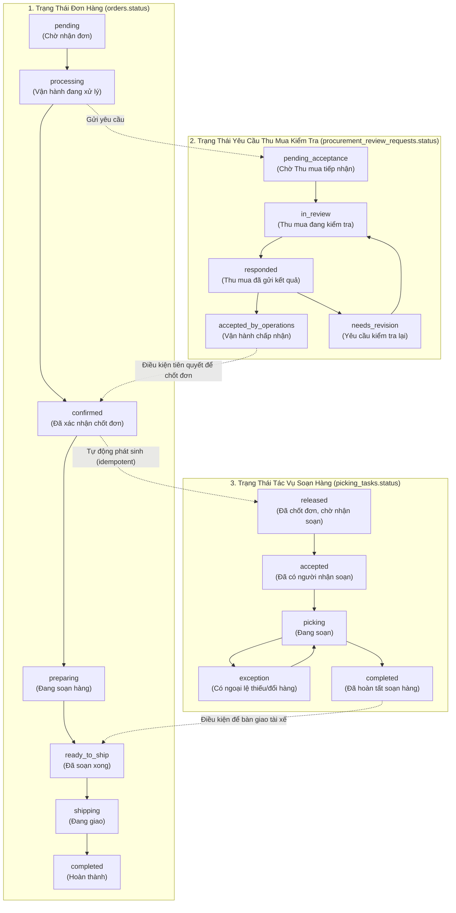

# Báo Cáo Khảo Sát Hiện Trạng & Thiết Kế Kiến Trúc (Gate G0)
## Luồng Thu Mua Kiểm Tra Hàng & Soạn Hàng TPS1

> **Tài liệu căn cứ:** [docs/GEMINI_THU_MUA_KIEM_TRA_VA_SOAN_HANG_PLAN.md](file:///d:/thuc_pham_so_mot/thuc_pham_so_mot/docs/GEMINI_THU_MUA_KIEM_TRA_VA_SOAN_HANG_PLAN.md)  
> **Checklist:** [docs/GEMINI_THU_MUA_KIEM_TRA_VA_SOAN_HANG_TASKLIST.md](file:///d:/thuc_pham_so_mot/thuc_pham_so_mot/docs/GEMINI_THU_MUA_KIEM_TRA_VA_SOAN_HANG_TASKLIST.md)  
> **Ngày lập:** 2026-10-05  
> **Nguyên tắc bảo vệ dữ liệu:** Không chạy migration trên production; không thay đổi dữ liệu thật; mọi fixture kiểm thử dùng tiền tố `TEST_PROC_`.

---

## 1. Bảng Hiện Trạng & Hành Vi Cần Sửa Đổi

| Phân hệ / Tệp mã nguồn | Hiện trạng trước G0 | Lỗi nghiệp vụ & rủi ro | Hành vi chuẩn hóa sau G0 -> G8 |
|:---|:---|:---|:---|
| **API Đơn tổng** [`app/api/admin/procurement/summary/route.ts`](file:///d:/thuc_pham_so_mot/thuc_pham_so_mot/app/api/admin/procurement/summary/route.ts#L43-L47) | Có tham số `includePending=1`, cho phép gom cả đơn `pending` vào số liệu gom hàng chung với đơn `confirmed`/`preparing`. | **Rất nguy hiểm:** Kho/Thu mua có thể soạn nhầm hoặc giao nhầm đơn mà khách mới chỉ bấm đặt trên Mini App, chưa được Vận hành thẩm định, chốt giá hay xác nhận. | **Tách biệt 100%:** 1. Đơn chưa xác nhận (`pending`, `processing`) chỉ nằm ở **Bảng kiểm tra nhu cầu** (phục vụ Thu mua khảo sát nguồn hàng/báo giá). 2. Hàng đợi **Soạn hàng** chỉ nhận đơn đã `confirmed` có `picking_task` hợp lệ. Xóa bỏ tùy chọn trộn lẫn `pending`. |
| **API Xuất Excel Đơn tổng** [`app/api/admin/procurement/export/route.ts`](file:///d:/thuc_pham_so_mot/thuc_pham_so_mot/app/api/admin/procurement/export/route.ts#L81-L85) | Cho phép xuất file gom hàng chứa đơn `pending` nếu truyền `includePending=1`. Tiêu đề file không cảnh báo tình trạng xác nhận. | Nhân viên cầm bảng in đi đóng gói/giao hàng cho đơn chưa xác nhận. | Đổi tiêu đề chứng từ xuất từ đơn chưa xác nhận thành: `BẢNG KIỂM TRA NHU CẦU — CHƯA PHẢI LỆNH SOẠN HÀNG`. Không cho xuất nhầm thành phiếu đóng gói. |
| **API Xuất Packing List** [`app/api/admin/reports/packing-list/export/route.ts`](file:///d:/thuc_pham_so_mot/thuc_pham_so_mot/app/api/admin/reports/packing-list/export/route.ts#L143-L148) | Khi truyền danh sách `orderIds`, API không lọc lại `status in ('confirmed', 'preparing', 'shipping')`. | Bất kỳ ai gửi request kèm ID đơn `pending` đều xuất được phiếu đóng gói chi tiết theo đơn. | Bổ sung ràng buộc bắt buộc: `query.in('id', orderIds).in('status', PACKING_STATUSES)`. Chặn tuyệt đối đơn `pending`. |
| **Quy trình Chốt giá & Xác nhận đơn** [`lib/order-finalize.ts`](file:///d:/thuc_pham_so_mot/thuc_pham_so_mot/lib/order-finalize.ts#L280-L365) | Cho phép Vận hành bấm xác nhận đơn (`status = 'confirmed'`) mà không kiểm tra xem Thu mua đã rà soát hàng hay chưa. | Bỏ qua bước kiểm tra hàng của Thu mua; xác nhận đơn xong mới phát hiện hết hàng hoặc thiếu giá, gây vỡ cam kết với khách. | **Khóa luồng xác nhận:** Chỉ cho phép xác nhận khi có phiên kiểm tra Thu mua đạt `accepted_by_operations`, không còn mặt hàng thiếu giá hoặc đề xuất treo. Trường hợp ngoại lệ cần quyền `orders.credit_override` hoặc `orders.approve_adjustment` và ghi nhận audit log lý do bắt buộc. |
| **Phát hành Tác vụ Soạn hàng** [`lib/order-finalize.ts`](file:///d:/thuc_pham_so_mot/thuc_pham_so_mot/lib/order-finalize.ts) | Khi đơn chuyển `confirmed`, chỉ tạo PDF xác nhận (`createConfirmationDocument`), chưa tạo thực thể `picking_tasks` có quản lý phiên bản. | Trạng thái soạn hàng chỉ là một cờ text `packing_status` trên đơn, không có bảng phân rã chi tiết từng dòng thực soạn, không ghi nhận được ngoại lệ thiếu/đổi sau xác nhận. | Tự động sinh một bản ghi `picking_tasks` duy nhất kèm `picking_task_items` tương ứng với `source_confirmation_version`. Đảm bảo tính idempotent khi retry. |
| **Giao diện Menu Điều Hướng** [`manage/src/layouts/SaleLayout.tsx`](file:///d:/thuc_pham_so_mot/thuc_pham_so_mot/manage/src/layouts/SaleLayout.tsx#L60-L66) | Menu chỉ có một mục gộp chung `Thu mua & Soạn hàng` dẫn tới `/don-tong`. | Người dùng bị lẫn lộn giữa việc "Thu mua kiểm tra hàng trước xác nhận" và "Soạn hàng chia đơn sau xác nhận". | Tách thành 2 menu rõ ràng: 1. **Kiểm tra hàng** (`/kiem-tra-hang`) 2. **Soạn hàng** (`/soan-hang`). Bỏ hoàn toàn thuật ngữ gộp `Đơn tổng` gây hiểu lầm. |
| **Chi tiết Đơn hàng** [`manage/src/pages/OrderDetailPage.tsx`](file:///d:/thuc_pham_so_mot/thuc_pham_so_mot/manage/src/pages/OrderDetailPage.tsx) | Thiếu section chuyên biệt cho luồng phản hồi từ Thu mua; các nút đổi trạng thái hiển thị tự do. | Vận hành không thấy được chênh lệch số lượng đặt vs đáp ứng, không có nút gửi Thu mua kiểm tra. | Bổ sung section **Kiểm tra từ Thu mua**: hiển thị trạng thái yêu cầu, người phụ trách, thời gian chờ, bảng so sánh chênh lệch; cung cấp các nút: `Nhận đơn`, `Gửi Thu mua kiểm tra`, `Xử lý phản hồi Thu mua`, `Yêu cầu kiểm tra lại`. |
| **Bàn làm việc Soạn hàng** [`manage/src/pages/SoanHangPage.tsx`](file:///d:/thuc_pham_so_mot/thuc_pham_so_mot/manage/src/pages/SoanHangPage.tsx) | Nhận soạn đơn trực tiếp bằng cách update `orders.packing_status`, không có kiểm soát số lượng thực tế từng dòng và không có xử lý ngoại lệ. | Không ghi nhận được trường hợp giao thiếu, đổi mã hoặc hư hỏng trong lúc soạn; âm thầm sửa số lượng đơn đã chốt mà không có phiên bản. | Xây dựng lại bàn làm việc Soạn hàng: hiển thị các task từ `picking_tasks` (chỉ đơn đã xác nhận), hỗ trợ gom đơn theo ngày giao, nhận soạn có khóa tranh chấp, nhập số lượng thực soạn, báo ngoại lệ và yêu cầu duyệt điều chỉnh. |

---

## 2. Thiết Kế Trạng Thái Độc Lập (3 Lớp Tách Rời)

Hệ thống tuân thủ nguyên tắc không nhồi nhét tất cả vào một cột `orders.status`:

---

## 3. Ma Trận Phân Quyền & Phòng Ban (RBAC)

Dựa trên cấu trúc phòng ban hiện có (`departments.function_group` gồm `operations`, `procurement`, `accounting`) và chức vụ (`admin_profiles.position`, `role`), phân quyền được quy định chặt chẽ:

| Nghiệp vụ / Thao tác | Vận hành (`operations` / `sale`) | Thu mua (`procurement` / `thu_mua`) | Kho (`kho`) | Trưởng phòng Vận hành | Trưởng phòng Thu mua | Ban Giám Đốc / Admin |
|:---|:---:|:---:|:---:|:---:|:---:|:---:|
| **Nhận đơn từ khách / tạo POS** | V | - | - | V | - | V |
| **Gửi yêu cầu Thu mua kiểm tra** | V | - | - | V | - | V |
| **Tiếp nhận yêu cầu kiểm tra hàng** | - | V | - | - | V | V |
| **Nhập kết quả kiểm tra từng dòng** | - | V | - | - | V | V |
| **Đề xuất giá mua / hàng thay thế** | - | V | - | - | V | V |
| **Gửi kết quả kiểm tra cho Vận hành** | - | V | - | - | V | V |
| **Yêu cầu Thu mua kiểm tra lại** | V | - | - | V | - | V |
| **Chấp nhận kết quả & chốt giá** | V | - | - | V | - | V |
| **Xác nhận đơn hàng & phát hành PDF** | V | - | - | V | - | V |
| **Bỏ qua bước Thu mua (override)** | - | - | - | V (ghi lý do) | - | V (ghi lý do) |
| **Xem danh sách Soạn hàng (đơn đã chốt)** | Xem | Xem | V | Xem | Xem | V |
| **Nhận soạn hàng (claim task)** | - | V | V | - | V | V |
| **Cập nhật số lượng thực soạn** | - | V | V | - | V | V |
| **Báo ngoại lệ soạn hàng (thiếu/đổi)** | - | V | V | - | V | V |
| **Duyệt ngoại lệ & điều chỉnh đơn sau chốt** | - | - | - | V | - | V |
| **Hoàn tất soạn hàng chuyển giao vận** | - | V | V | V | V | V |

---

## 4. Tái Sử Dụng Thành Phần CSDL & Mã Nguồn Hiện Hữu

Nhằm không tạo các chức năng song song gây phân mảnh:
1. **Bảng `orders` & `order_items`**: Giữ nguyên toàn bộ cấu trúc hiện hành. `orders` giữ `price_revision` để liên kết phiên bản tài liệu với `picking_tasks.source_confirmation_version`.
2. **Hệ thống tạo chứng từ PDF** ([`lib/order-finalize.ts`](file:///d:/thuc_pham_so_mot/thuc_pham_so_mot/lib/order-finalize.ts), [`lib/order-confirmation-pdf.ts`](file:///d:/thuc_pham_so_mot/thuc_pham_so_mot/lib/order-confirmation-pdf.ts)): Tái sử dụng để tạo snapshot chứng từ khi đơn được xác nhận.
3. **Cơ chế xác thực Admin Auth & Hồ sơ Phòng ban** ([`lib/admin-auth.ts`](file:///d:/thuc_pham_so_mot/thuc_pham_so_mot/lib/admin-auth.ts), [`lib/permissions.ts`](file:///d:/thuc_pham_so_mot/thuc_pham_so_mot/lib/permissions.ts)): Sử dụng `canForProfile` để kiểm tra quyền hạn theo cả phòng ban (`department_id`) và chức vụ (`position`).
4. **Bảng `order_history`**: Dùng để ghi log toàn bộ sự kiện chuyển trạng thái, người thao tác, thời điểm và lý do.

---

## 5. Danh Sách Các Tệp Tin Sẽ Được Triển Khai Tuần Tự (G1 -> G8)

### Giai đoạn G1 — CSDL, RPC & Bảo mật:
- `tps1-miniapp/supabase/migrations/20261005_procurement_review_and_picking.sql` (Migration các bảng mới, sequences, RPC tiếp nhận nguyên tử, RLS)
- `tps1-miniapp/supabase/migrations/20261005_procurement_review_and_picking_rollback.sql` (Rollback an toàn)
- `scratch/test_procurement_picking_suite.mjs` (Script kiểm thử tích hợp trên engine PostgreSQL độc lập)

### Giai đoạn G2 & G4 — Lớp Backend API & Dịch vụ:
- `lib/permissions.ts` (Bổ sung ma trận quyền cho phân hệ kiểm tra & soạn hàng)
- `lib/procurement-service.ts` (Lõi dịch vụ tiếp nhận, lưu nháp, phản hồi kiểm tra hàng)
- `lib/picking-service.ts` (Lõi dịch vụ tạo picking task, nhận soạn, ngoại lệ, hoàn tất)
- `lib/order-finalize.ts` (Khóa chặn xác nhận đơn khi chưa kiểm tra & sinh picking task nguyên tử)
- `app/api/admin/procurement/reviews/route.ts` (API danh sách & tạo yêu cầu kiểm tra hàng)
- `app/api/admin/procurement/reviews/[id]/route.ts` (API chi tiết, tiếp nhận, lưu nháp, gửi phản hồi)
- `app/api/admin/procurement/reviews/[id]/operations/route.ts` (API Vận hành duyệt / yêu cầu kiểm tra lại)
- `app/api/admin/picking/tasks/route.ts` (API danh sách tác vụ soạn hàng)
- `app/api/admin/picking/tasks/[id]/route.ts` (API chi tiết, tiếp nhận soạn, cập nhật thực soạn, hoàn tất)
- `app/api/admin/picking/exceptions/route.ts` (API tạo và xử lý ngoại lệ soạn hàng)
- `app/api/admin/notifications/route.ts` (API thông báo nội bộ in-app)
- `app/api/admin/orders/route.ts` (Chặn đổi trạng thái trực tiếp bypass kiểm tra)

### Giai đoạn G5 — Phân Tách Chứng Từ:
- `app/api/admin/procurement/summary/route.ts` (Bảng kiểm tra nhu cầu - CHẶN đơn đã chốt và đơn pending nhầm lẫn)
- `app/api/admin/procurement/export/route.ts` (Xuất Excel Bảng kiểm tra nhu cầu - tiêu đề chuẩn)
- `app/api/admin/reports/packing-list/export/route.ts` (Xuất Excel Danh sách soạn hàng - CHẶN 100% đơn pending)

### Giai đoạn G3, G6, G7 — Giao Diện Quản Trị (Manage Frontend):
- `manage/src/lib/permissions.ts` (Đồng bộ quyền client)
- `manage/src/layouts/SaleLayout.tsx` (Tách menu `Kiểm tra hàng` và `Soạn hàng`)
- `manage/src/App.tsx` (Đăng ký routes `/kiem-tra-hang`, `/kiem-tra-hang/:id`)
- `manage/src/pages/KiemTraHangPage.tsx` (Bàn làm việc Kiểm tra hàng cho Thu mua: 5 tab, SLA badge, lọc)
- `manage/src/pages/KiemTraHangDetailPage.tsx` (Màn hình chi tiết kiểm tra từng dòng, hàng loạt "Đủ hàng", đề xuất)
- `manage/src/pages/SoanHangPage.tsx` (Bàn làm việc Soạn hàng cho đơn đã xác nhận, tạo danh sách soạn, báo ngoại lệ)
- `manage/src/pages/OrderDetailPage.tsx` (Section "Kiểm tra từ Thu mua", nút nhận đơn, gửi kiểm tra, khóa xác nhận)
- Đồng bộ toàn bộ sang repo phụ `webapptps1/manage/...`

---
*Báo cáo Gate G0 hoàn thành — Chuyển sang thực hiện G1 theo quy trình.*
