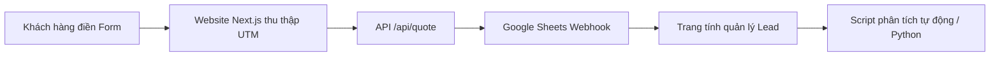

# 📈 SỔ TAY VẬN HÀNH PHÂN TÍCH DỮ LIỆU B2B (DATA ANALYTICS PLAYBOOK)

Sổ tay này hướng dẫn cách theo dõi, đo lường và phân tích dữ liệu marketing/kinh doanh cho **Thực Phẩm Số Một (TPS1)**. Chúng ta sẽ chuyển dịch từ việc "dự đoán bằng cảm tính" sang **"ra quyết định dựa trên dữ liệu" (Data-Driven Decision Making)**.

---

## 🛠️ 1. Quy Trình Thu Thập Dữ Liệu (B2B Data Pipeline)

Hiện tại, TPS1 thu thập yêu cầu báo giá từ Website và gửi về Google Sheet thông qua một Webhook bằng Apps Script (`google-sheet-webhook.gs`). Quy trình chuẩn hóa dữ liệu như sau:



### A. Theo dõi nguồn khách hàng (UTM Tracking)
Để biết lead (cơ hội kinh doanh) đến từ chiến dịch nào, chúng ta cần bắt buộc lưu trữ các tham số UTM khi người dùng điền form báo giá:
*   `utm_source`: Nguồn (ví dụ: `google`, `facebook`, `zalo`, `sales_outbound`).
*   `utm_medium`: Kênh tiếp cận (ví dụ: `seo`, `cpc` - quảng cáo trả phí, `direct`, `qr_code`).
*   `utm_campaign`: Tên chiến dịch (ví dụ: `khai_truong_he_2026`, `landing_page_truong_hoc`).

*Code Next.js gợi ý để bắt UTM và lưu vào sessionStorage/form submission:*
```typescript
// Hàm lấy tham số UTM từ URL
export function getUTMParams() {
  if (typeof window === 'undefined') return {};
  const params = new URLSearchParams(window.location.search);
  return {
    utm_source: params.get('utm_source') || 'direct',
    utm_medium: params.get('utm_medium') || 'direct',
    utm_campaign: params.get('utm_campaign') || 'none',
  };
}
```

---

## 🎯 2. Đánh Giá Chất Lượng Lead (B2B Lead Scoring)

Trong B2B, không phải mọi lead đều có giá trị như nhau. Một lead từ trường học 2,000 học sinh có giá trị hơn rất nhiều so với một quán ăn nhỏ. Chúng ta sẽ phân loại Lead theo thang điểm:

| Nhóm Khách Hàng | Quy Mô Dự Kiến | Điểm Số (Score) | Độ Ưu Tiên | Hành Động |
| :--- | :--- | :---: | :---: | :--- |
| Bếp ăn nhà máy / KCN | > 1,000 suất/ngày | **9 - 10** | Rất Cao (Hot) | Gọi điện trong 15 phút, Giám đốc đi gặp trực tiếp |
| Trường học bán trú | > 500 học sinh | **8 - 9** | Cao | Gửi hồ sơ năng lực & mẫu thử trong ngày |
| Nhà hàng lớn / Tiệc cưới | Đều đặn mỗi ngày | **6 - 7** | Trung Bình | Sales liên hệ tư vấn bảng giá sỉ |
| Quán ăn nhỏ / Cá nhân | < 50 suất/ngày | **3 - 5** | Thấp | Gửi bảng giá tự động qua Zalo/Email |

---

## 🐍 3. Script Python Phân Tích Hiệu Quả Marketing (Marketing ROI & Lead Conversion)

Dưới đây là đoạn mã Python chuyên sâu giúp anh phân tích dữ liệu Lead từ file xuất ra từ Google Sheets. Script này tự động tính toán tỷ lệ chuyển đổi (Conversion Rate) và chi phí trên mỗi lead chất lượng (Cost per Qualified Lead).

> [!NOTE]
> Đoạn code này được lưu và sẵn sàng chạy bất cứ lúc nào anh tải file dữ liệu lên thư mục `scratch/`.

```python
import pandas as pd
import numpy as np

def analyze_lead_data(file_path):
    # 1. Đọc dữ liệu từ file xuất của Google Sheets
    try:
        df = pd.read_excel(file_path) # Hoặc pd.read_csv(file_path)
        print("✅ Đã nạp dữ liệu thành công!")
    except Exception as e:
        print(f"❌ Lỗi đọc file: {e}")
        return None
    
    # Chuẩn hóa cột tên
    df.columns = [c.strip().lower().replace(" ", "_") for c in df.columns]
    
    # Yêu cầu file phải có các cột: utm_source, status (win/lost/processing), lead_value, cost
    required_cols = ['utm_source', 'status', 'lead_value']
    for col in required_cols:
        if col not in df.columns:
            print(f"⚠️ Thiếu cột bắt buộc: {col}")
            # Mock dữ liệu để chạy demo nếu thiếu
            df[col] = np.random.choice(['google', 'facebook', 'zalo', 'outbound'], size=len(df))
            if col == 'status':
                df['status'] = np.random.choice(['win', 'lost', 'processing'], size=len(df), p=[0.2, 0.5, 0.3])
            if col == 'lead_value':
                df['lead_value'] = np.random.randint(5000000, 50000000, size=len(df))

    # 2. Tính toán các chỉ số cốt lõi
    total_leads = len(df)
    won_leads = len(df[df['status'] == 'win'])
    conversion_rate = (won_leads / total_leads) * 100 if total_leads > 0 else 0
    total_revenue = df[df['status'] == 'win']['lead_value'].sum()
    
    print("\n" + "="*40)
    print("📊 BÁO CÁO PHÂN TÍCH HIỆU SUẤT LEAD B2B")
    print("="*40)
    print(f"🔹 Tổng số cơ hội (Leads): {total_leads}")
    print(f"🔹 Số hợp đồng thành công (Wins): {won_leads}")
    print(f"🔹 Tỷ lệ chuyển đổi (CR): {conversion_rate:.2f}%")
    print(f"🔹 Tổng doanh thu ước tính từ hợp đồng mới: {total_revenue:,.0f} VND")
    
    # 3. Phân tích theo Nguồn (utm_source)
    source_stats = df.groupby('utm_source').agg(
        total_leads=('status', 'count'),
        wins=('status', lambda x: (x == 'win').sum()),
        total_val=('lead_value', lambda x: x[df['status'] == 'win'].sum())
    )
    source_stats['conversion_rate'] = (source_stats['wins'] / source_stats['total_leads']) * 100
    
    print("\n📈 HIỆU QUẢ THEO TỪNG NGUỒN TIẾP CẬN:")
    print(source_stats.to_string())
    print("="*40)
    
    return source_stats

# Hướng dẫn chạy:
# analyze_lead_data("d:/AI_Business/workspace/thuc_pham_so_1/scratch/leads_export.xlsx")
```

---

## 📊 4. Các Chỉ Số Cần Theo Dõi Hàng Tháng (Key Performance Indicators - KPIs)

1.  **CPL (Cost Per Lead):** Tổng ngân sách quảng cáo / Tổng số lead nhận được.
2.  **CPQL (Cost Per Qualified Lead):** Tổng ngân sách quảng cáo / Số lượng lead đạt từ 7 điểm trở lên. (Chỉ số này cực kỳ quan trọng vì nó loại bỏ các lead ảo).
3.  **CAC (Customer Acquisition Cost):** Tổng chi phí Marketing + Sales / Số lượng hợp đồng ký thành công.
4.  **LTV (Customer Lifetime Value):** Giá trị vòng đời khách hàng B2B. Một bếp ăn nhà máy ký hợp đồng 1 năm có thể đem lại doanh thu hàng tỷ đồng. Do đó, CAC trong B2B có thể chấp nhận ở mức cao (ví dụ: vài triệu đến chục triệu đồng cho 1 khách hàng mới).
