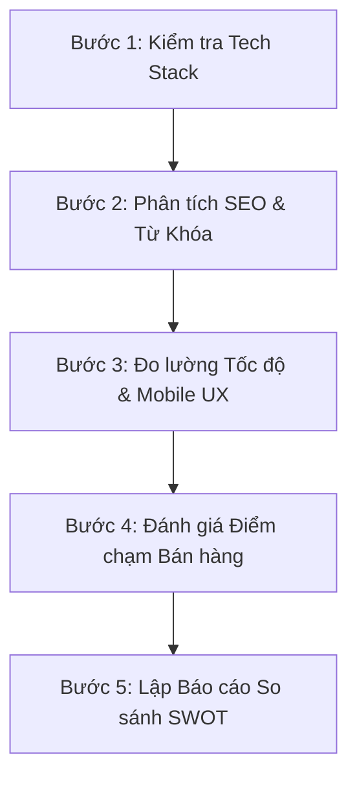

# 🔍 KHUNG PHÂN TÍCH & NGHIÊN CỨU THỊ TRƯỜNG (RESEARCH & COMPETITOR INTELLIGENCE GUIDE)

Để giúp anh phân tích thị trường và đối thủ cạnh tranh hiệu quả như một **Chuyên gia Nghiên cứu cấp cao (Senior Research Expert)**, tài liệu này hướng dẫn cách áp dụng các khung tư duy (Frameworks) và quy trình kỹ thuật để thu thập thông tin đối thủ.

---

## 🏛️ 1. Các Khung Tư Duy Kinh Điển Ứng Dụng Thực Tế

Chúng ta không dùng lý thuyết suông, mà áp dụng các mô hình này trực tiếp để giải bài toán kinh doanh thực tế của TPS1:

### A. Phân Tích SWOT (Điểm mạnh - Điểm yếu - Cơ hội - Thách thức)
Áp dụng cho TPS1 trong tương quan với các đối thủ lâu năm:
*   **Strengths (Điểm mạnh của TPS1):**
    *   Hệ thống website mới tối ưu Local SEO vượt trội, tốc độ tải trang cực nhanh trên mobile.
    *   Tự động hóa báo giá nhanh (giảm thời gian chờ đợi của khách hàng).
    *   Sơ chế theo quy cách yêu cầu của từng bếp trưởng.
*   **Weaknesses (Điểm yếu):**
    *   Thương hiệu mới, cần thời gian để tích lũy các Case-study lớn làm bằng chứng uy tín (Social Proof).
*   **Opportunities (Cơ hội):**
    *   Xu hướng các doanh nghiệp FDI (Hàn Quốc, Nhật Bản, Đài Loan) tại Bình Dương, Đồng Nai đòi hỏi quy trình minh bạch, hóa đơn chứng từ đầy đủ và giao dịch số hóa — đây là thế mạnh của chúng ta.
*   **Threats (Thách thức):**
    *   Đối thủ lâu năm có mối quan hệ sâu sắc với các phòng thu mua, chấp nhận chiết khấu cao.

### B. Khung STP (Segmentation - Targeting - Positioning)
*   **Segmentation (Phân khúc):** Chia thị trường cung cấp thực phẩm thành: Suất ăn công nghiệp, Bếp ăn trường học, Bệnh viện, Nhà hàng trung-cao cấp, Quán ăn bình dân.
*   **Targeting (Mục tiêu):** Tập trung vào **Bếp ăn công nghiệp nhà máy** và **Trường học bán trú/nội trú** tại khu vực Đông Nam Bộ (Bình Dương, Đồng Nai, TP.HCM).
*   **Positioning (Định vị):** TPS1 là *"Nhà cung ứng thực phẩm sỉ chuẩn hóa, minh bạch pháp lý và giao hàng đúng giờ số 1 khu vực"* (không định vị giá rẻ nhất, mà định vị **an toàn nhất và chuyên nghiệp nhất**).

---

## 🕵️ 2. Quy Trình Nghiên Cứu Đối Thủ Cạnh Tranh (Competitor Intelligence Checklist)

Khi anh muốn quét hoặc nghiên cứu bất kỳ đối thủ nào (ví dụ: Bếp Đỉnh, Atlas Finefood,...), hãy chạy qua checklist 5 bước sau:



### 📋 Checklist chi tiết:
1.  **Kiểm tra Tech Stack (Công nghệ):**
    *   Xem đối thủ dùng WordPress, Next.js hay PHP tự viết.
    *   *Mẹo:* Xem mã nguồn (View Source) tìm `/wp-content/` (WordPress), hoặc dùng extension như Wappalyzer.
2.  **Phân tích SEO & Từ Khóa (SEO & Keyword Profile):**
    *   Tìm các trang dịch vụ chính của đối thủ xem họ viết tiêu đề (Title) và thẻ H1 như thế nào.
    *   Kiểm tra mật độ từ khóa và các chủ đề blog họ đang tập trung viết.
3.  **Đo lường Tốc độ & Trải nghiệm Di động (Mobile Performance):**
    *   Sử dụng công cụ `Google PageSpeed Insights` để kiểm tra điểm Core Web Vitals của đối thủ.
    *   *Mục tiêu:* Điểm mobile của TPS1 phải luôn xanh (>90) để vượt lên trên công cụ tìm kiếm của Google.
4.  **Đánh giá Điểm chạm Bán hàng (Sales Touchpoints):**
    *   Họ có nút Zalo/Hotline nổi trên màn hình không?
    *   Họ có Form báo giá không và thời gian họ phản hồi sau khi điền form là bao lâu? (Đóng vai khách hàng để test).

---

## 🐍 3. Mã Nguồn Thu Thập Thông Tin Đối Thủ (Simple Web Scraper)

Để hỗ trợ nghiên cứu tự động, đây là script Python dùng thư viện `BeautifulSoup` và `requests` để cào cấu trúc thẻ tiêu đề (H1, H2, H3) và các liên kết từ website đối thủ, giúp anh phân tích nhanh cấu trúc SEO của họ.

```python
import requests
from bs4 import BeautifulSoup

def crawl_competitor_seo(url):
    headers = {
        'User-Agent': 'Mozilla/5.0 (Windows NT 10.0; Win64; x64) AppleWebKit/537.36 (KHTML, like Gecko) Chrome/115.0.0.0 Safari/537.36'
    }
    
    print(f"🕵️ Đang phân tích SEO website: {url}...")
    try:
        response = requests.get(url, headers=headers, timeout=10)
        response.raise_for_status()
    except Exception as e:
        print(f"❌ Không thể truy cập URL: {e}")
        return
        
    soup = BeautifulSoup(response.text, 'html.parser')
    
    # Lấy Title và Meta Description
    title = soup.find('title')
    meta_desc = soup.find('meta', attrs={'name': 'description'})
    
    print("\n" + "="*50)
    print(f"📝 Tiêu đề trang (Title Tag): {title.text.strip() if title else 'Không tìm thấy'}")
    print(f"📝 Meta Description: {meta_desc['content'].strip() if meta_desc else 'Không tìm thấy'}")
    print("="*50)
    
    # Thu thập các thẻ Header
    for level in ['h1', 'h2', 'h3']:
        headers_found = soup.find_all(level)
        print(f"\n📌 Danh sách thẻ {level.upper()} ({len(headers_found)} thẻ):")
        for i, h in enumerate(headers_found[:10], 1): # Chỉ in tối đa 10 thẻ đầu
            print(f"  {i}. {h.text.strip()}")
            
    # Thu thập tất cả các link nội bộ/ngoại bộ để xem cấu trúc menu
    links = soup.find_all('a', href=True)
    print(f"\n🔗 Tổng số liên kết tìm thấy: {len(links)}")
    print("="*50)

# Ví dụ chạy:
# crawl_competitor_seo("https://atlasfinefood.com")
```

---

## 📚 4. Tài Nguyên Đào Tạo Tiếp Thị & Phân Tích Khuyên Dùng

Để củng cố chuyên môn liên tục, anh có thể tham khảo các nguồn chất lượng sau:
*   **Google Analytics Academy:** Các khóa học miễn phí từ cơ bản đến nâng cao về GA4 và Google Tag Manager.
*   **HubSpot Academy:** Rất mạnh về Inbound Marketing và B2B Sales.
*   **Ahrefs Blog & Academy:** Kênh học SEO và nghiên cứu từ khóa tốt nhất thế giới.
*   **Think with Google:** Báo cáo thị trường, xu hướng người tiêu dùng cập nhật liên tục từ Google.
